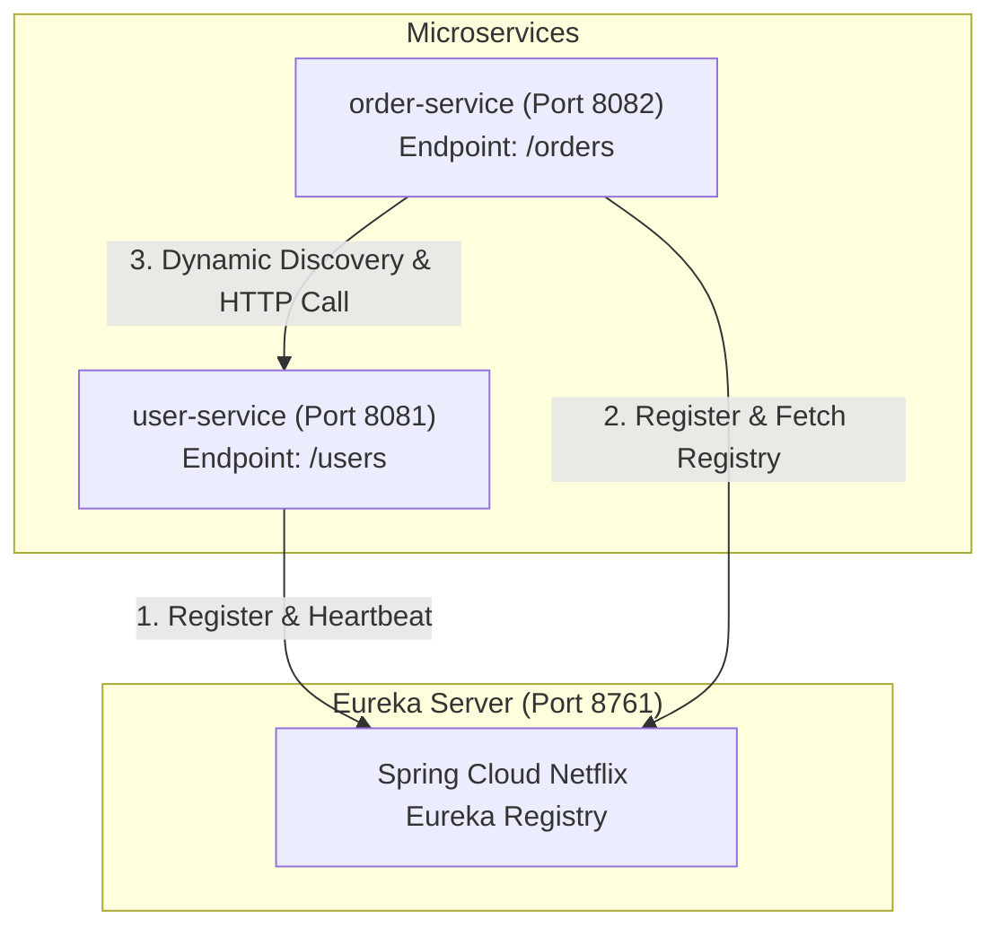
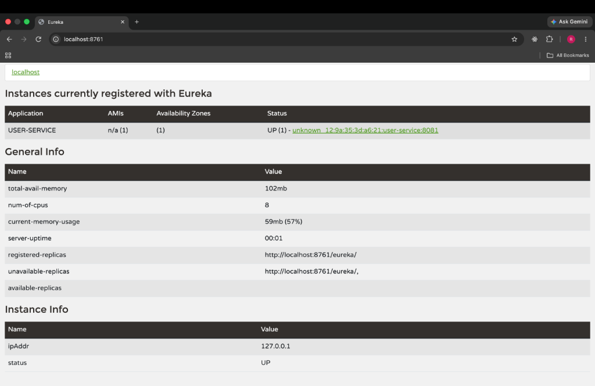
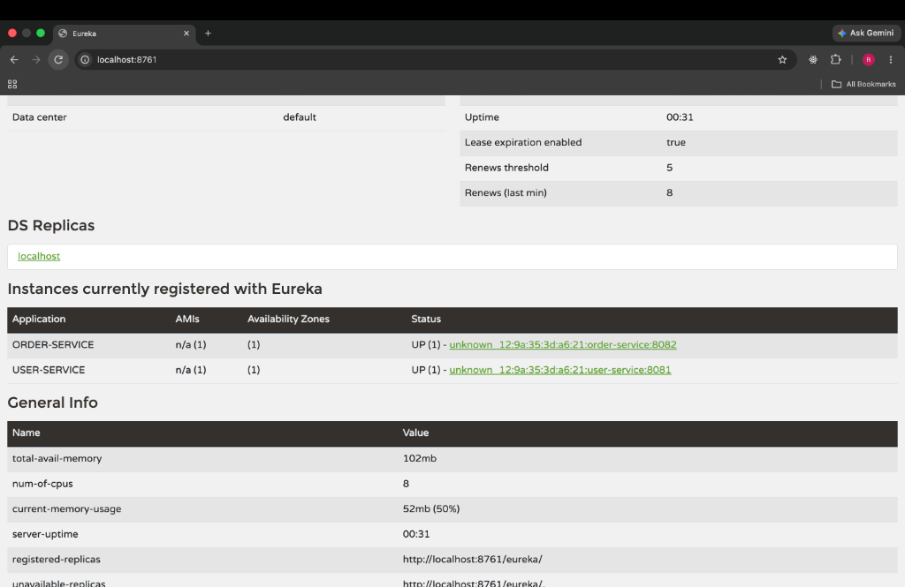
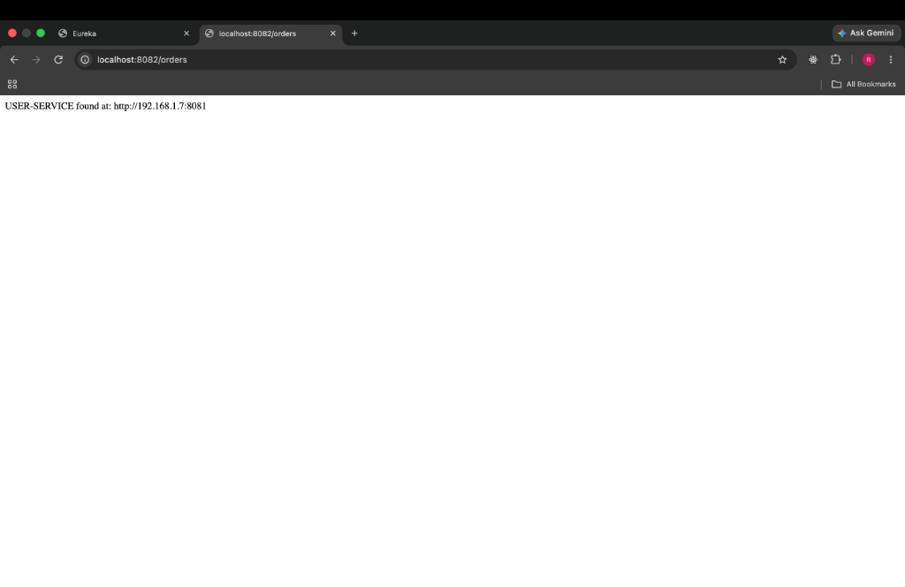

# 🚀 Spring Cloud Eureka Microservices Architecture

A production-ready demonstration of **Service Discovery**, **Service Registration**, and **Inter-Service Communication** using **Spring Boot 3 / 4.x** and **Spring Cloud Netflix Eureka**.

---

## 📌 Architecture Overview

This repository demonstrates a complete microservices workflow where microservices register themselves dynamically with a centralized Service Registry (`eurekaserver`) and communicate with each other using Eureka dynamic discovery (`DiscoveryClient`) without hardcoded service IP addresses.



### Core Microservices

1. **`eurekaserver`** (Service Registry Server)
   - **Port**: `8761`
   - **Dashboard**: [`http://localhost:8761`](http://localhost:8761)
   - Central Eureka Server managing dynamic IP/Port mappings of registered client services.

2. **`user-service`** (Microservice Client)
   - **Port**: `8081`
   - **Endpoint**: `/users`
   - Self-registers with Eureka Server on startup and serves user domain requests.

3. **`order-service`** (Microservice Client with Dynamic Inter-Service Call)
   - **Port**: `8082`
   - **Endpoint**: `/orders`
   - Self-registers with Eureka Server and uses `DiscoveryClient` & `RestClient` to discover `user-service` dynamically at runtime and execute inter-service REST calls.

---

## 📸 System Screenshots & Workflow Verification

### 1️⃣ User Service Registration
When `eurekaserver` and `user-service` are started, `user-service` registers automatically with the Eureka registry.



---

### 2️⃣ Multi-Service Eureka Registry Dashboard
Starting `order-service` alongside `user-service` shows both instances actively registered and heartbeating under **Instances currently registered with Eureka**.



---

### 3️⃣ Dynamic Inter-Service Discovery & Response (`/orders`)
When triggering `GET http://localhost:8082/orders`, `order-service` queries Eureka using `DiscoveryClient`, resolves the active `user-service` URI, and invokes its `/users` API endpoint using `RestClient`.



---

## 🛠️ Tech Stack

- **Java**: Version 17
- **Framework**: Spring Boot (`4.1.1` / `3.x` compatible)
- **Cloud Infrastructure**: Spring Cloud Netflix Eureka (`2025.1.3`)
- **HTTP Client**: Spring `RestClient` with `DiscoveryClient`
- **Build Tool**: Apache Maven (Wrapper included in each module)

---

## 📁 Repository Structure

```text
EUREKA/
├── eurekaserver/                # Eureka Service Registry (Port 8761)
│   ├── src/
│   └── pom.xml
├── user-service/                # User Microservice (Port 8081)
│   ├── src/
│   └── pom.xml
├── order-service/               # Order Microservice (Port 8082)
│   ├── src/
│   └── pom.xml
├── docs/
│   └── screenshots/             # Workflow verification screenshots
│       ├── eureka-user-service.png
│       ├── eureka-order-and-user-services.png
│       └── order-service-inter-service-call.png
└── README.md                    # Project documentation
```

---

## 🚀 Getting Started

### Prerequisites

- **JDK 17** or higher
- Maven (optional, Maven wrapper `./mvnw` is included in each service folder)

---

### 🏃 Step-by-Step Run Instructions

#### 1️⃣ Start the Eureka Server
The Eureka Registry must be running before starting dependent microservices.

```bash
cd eurekaserver
./mvnw spring-boot:run
```
> 🌐 Access Dashboard: [http://localhost:8761](http://localhost:8761)

#### 2️⃣ Start the User Service
In a new terminal window:

```bash
cd user-service
./mvnw spring-boot:run
```
> 🌐 Verify endpoint: `curl http://localhost:8081/users`

#### 3️⃣ Start the Order Service
In another terminal window:

```bash
cd order-service
./mvnw spring-boot:run
```
> 🌐 Verify dynamic discovery call: `curl http://localhost:8082/orders`

---

## 📡 API Endpoints

| Service | HTTP Method | Endpoint | Description | Sample Output |
| :--- | :--- | :--- | :--- | :--- |
| **`eurekaserver`** | `GET` | `/` | Web UI Dashboard | Eureka Web Console |
| **`user-service`** | `GET` | `/users` | Returns user data | `Users returned from USER-SERVICE` |
| **`order-service`** | `GET` | `/orders` | Discovers `user-service` via Eureka & returns data | `Users returned from USER-SERVICE` |

---

## 💡 Key Implementation Snippets

### Dynamic Service Discovery in `OrderController.java`

`order-service` uses `DiscoveryClient` to fetch instances of `user-service` dynamically and executes the HTTP request via Spring's modern `RestClient`:

```java
@RestController
public class OrderController {

    private final DiscoveryClient discoveryClient;
    private final RestClient restClient;

    public OrderController(DiscoveryClient discoveryClient) {
        this.discoveryClient = discoveryClient;
        this.restClient = RestClient.builder().build();
    }

    @GetMapping("/orders")
    public String getOrders() {
        List<ServiceInstance> instances = discoveryClient.getInstances("user-service");

        if (instances.isEmpty()) {
            return "USER-SERVICE is unavailable";
        }

        ServiceInstance instance = instances.get(0);
        String url = instance.getUri() + "/users";

        return restClient
                .get()
                .uri(url)
                .retrieve()
                .body(String.class);
    }
}
```

---

## ⚙️ Configuration Properties

### `eurekaserver/src/main/resources/application.properties`
```properties
spring.application.name=eureka-server
server.port=8761

eureka.client.register-with-eureka=false
eureka.client.fetch-registry=false
eureka.instance.prefer-ip-address=true
eureka.instance.ip-address=127.0.0.1
```

### `user-service/src/main/resources/application.properties`
```properties
spring.application.name=user-service
server.port=8081

eureka.client.service-url.defaultZone=http://localhost:8761/eureka/
eureka.instance.prefer-ip-address=true
```

### `order-service/src/main/resources/application.properties`
```properties
spring.application.name=order-service
server.port=8082

eureka.client.service-url.defaultZone=http://localhost:8761/eureka/
eureka.instance.prefer-ip-address=true
```

---

## 📄 License

This project is open-source and intended for microservice architecture training and reference.
